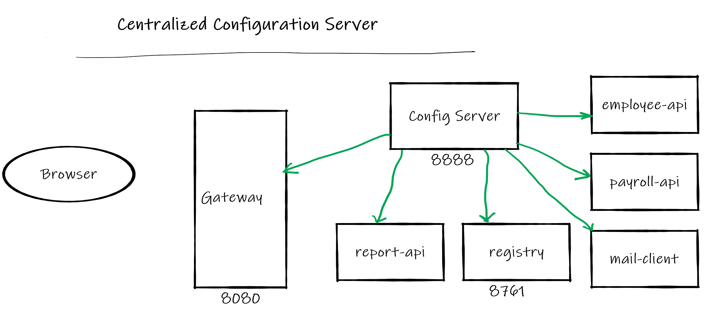

# Spring Cloud Session-7 Centralized Configuration
In  this tutorial we are going to learn how to manage configurations of microservices. The configurations  
of microservices are saved in central configuration server.We are going to use **spring-cloud-config-server** to centrally
manage configurations.

**Overview**
- Start spring-cloud-config-server on port 8888
- All (gateway,registry,employee-api,payroll-api,report-api,mail-client) the microservices when starting they are going 
to read configurations from configuration server microservice (config-server).
- config-server is going to store configurations in file system

# Source Code 
``` git clone https://github.com/balajich/spring-cloud-session-7-microservices-centralized-configuration.git``` 
# Video
[](https://www.youtube.com/watch?v=8CV8PDX8Kuc)
- https://youtu.be/8CV8PDX8Kuc
# Architecture

# Trace, Span

# Prerequisite
- JDK 1.8 or above
- Apache Maven 3.6.3 or above
- Vagrant, Virtualbox (To run RabbitMQ Server, Zapkin)
# Start RabbitMQ, Zipkin Servers and Build Microservices
We will be running RabbitMQ,Zipkin server inside a docker container. I am running docker container on CentOS7 virtual machine. 
I will be using vagrant to stop or start a virtual machine.

**Note:Zipkin is used for distributed tracing, Please follow my session-6 to understand it better**
- RabbitMQ & Zipkin Server
    - ``` cd  spring-cloud-session-7-microservices-centralized-configuration ```
    - Bring virtual machine up ``` vagrant up ```
    - ssh to virtual machine ```vagrant ssh ```
    - Switch to root user ``` sudo su - ```
    - Change folder where docker-compose files is available ```cd /vagrant```
    - Start RabbitMQ & Zipkin Server using docker-compose ``` docker-compose up -d ```
- Java
    - ``` cd  spring-cloud-session-7-microservices-centralized-configuration ```
    - ``` mvn clean install ```

# Running components
- Config Server: ``` java -jar .\config-server\target\config-server-0.0.1-SNAPSHOT.jar ```
- Registry: ``` java -jar .\registry\target\registry-0.0.1-SNAPSHOT.jar ```
- Employee API: ``` java -jar .\employee-api\target\employee-api-0.0.1-SNAPSHOT.jar ```
- Payroll API: ``` java -jar .\payroll-api\target\payroll-api-0.0.1-SNAPSHOT.jar ```
- Report API: ``` java -jar .\report-api\target\report-api-0.0.1-SNAPSHOT.jar ```
- Mail Client App: ``` java -jar .\mail-client\target\mail-client-0.0.1-SNAPSHOT.jar ```
- Gateway: ``` java -jar .\gateway\target\gateway-0.0.1-SNAPSHOT.jar ``` 

# Using curl to test environment
**Note I am running CURL on windows, if you have any issue. Please use postman client, its collection is available 
at  spring-cloud-session-7-microservices-centralized-configuration.postman_collection.json**
- Get employee report using report api ( direct): ``` curl -s -L  http://localhost:8080/report-api/100 ```
- Get Configurations of employee-api  with **default** profile``` curl -s -L http://localhost:8888/employee-api/default ```
- Get Configurations of report-api  with **default** profile``` curl -s -L http://localhost:8888/report-api/default ```
 
# Code
In this section we will focus only employee-api and add sleuth and zipkin as dependency. This will automatically enable
employee-api to write trace information to zipkin queue that is present in RabbitMQ Server. Note the configs are same for 
other microservices.

**pom.xml**
```xml
         <dependency>
             <groupId>org.springframework.cloud</groupId>
             <artifactId>spring-cloud-starter-sleuth</artifactId>
         </dependency>
         <dependency>
             <groupId>org.springframework.cloud</groupId>
             <artifactId>spring-cloud-starter-zipkin</artifactId>
         </dependency>
         <dependency>
             <groupId>org.springframework.cloud</groupId>
             <artifactId>spring-cloud-starter-stream-rabbit</artifactId>
         </dependency>
```
**application.yml** in employee-api.  Asking zipkin to use RabbitMQ as messagebus and Sleuth to send every trace information.
By default, Sleuth will send only 10% of trace information.
```yaml
 zipkin:
     sender:
       type: rabbit
   sleuth:
     sampler:
       probability:  1.0
```
# References
- Spring Microservices in Action by John Carnell 
- Hands-On Microservices with Spring Boot and Spring Cloud: Build and deploy Java microservices 
using Spring Cloud, Istio, and Kubernetes -Magnus Larsson
# Next Tutorial
How to deploy microservices using docker
- https://github.com/balajich/spring-cloud-session-6-microservices-deployment-docker